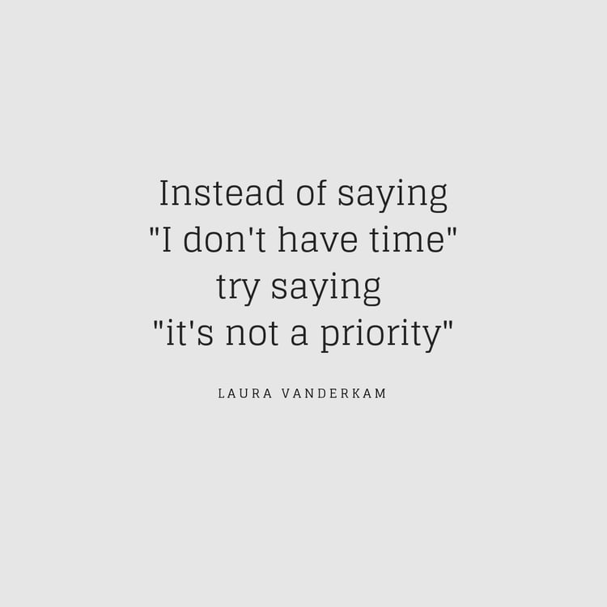

Developing an environment in which you and your team are consistently sharing and learning new things is crucial to surviving in the fast-paced world we find ourselves in. According to [HackerRank’s 2019 Developer Skills Report](http://hr.gs/frmlyn) a learning culture is the number one criterion for developers who are job hunting.

> “The most important factors for developers, across all job levels and functions, was the opportunity for professional growth and work-life balance.”

The word “culture” can easily be substituted with “mindset” in this article. Whether you’re a company or a one man band, here are 6 effective ways in which to cultivate a continuous learning environment.

#### 1. Read widely, make it a habit

Not twitter, real books.

#### 2. Keep smart company

Surround yourself with people who are smarter or think differently than you whenever you can. Hire curious people.

#### 3. Share what you know

It’s really, quite simple: [See one, do one, teach one](https://pjrvs.com/doone/)

If you require further incentive, [learning by teaching has proven to be extremely effective.](https://digest.bps.org.uk/2018/05/04/learning-by-teaching-others-is-extremely-effective-a-new-study-tested-a-key-reason-why/)

#### 4. Keep a list of things you want to learn

I use [github](https://github.com/tinavanschelt/lifelong-learning/)

#### 5. Start your own (side) project

Internal or side projects are a great opportunity to accelerate learning and experiment with new tools and frameworks.

#### 6. Prioritise learning

Laura Vanderkam laid this out beautifully in her 2012 Wall Street Journal article: [Are you as busy as you think?](https://lauravanderkam.com/2012/06/busy-think-2/)

