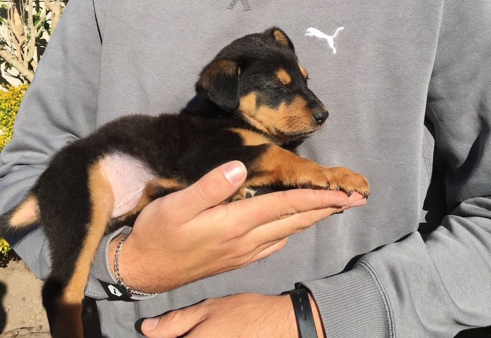

It was just a regular Saturday. My husband "went to Builder’s Warehouse", a pretty standard outing for young home owners on a Saturday morning. When he came home, he asked me if it was okay if we spent a little extra money that month and subsequently presented me with a big blue dog collar and leash. There may have been tears.

That afternoon we went to a dog shelter in the Northern Suburbs of Cape Town, <a href="https://www.facebook.com/bellasguardianangels/" target="_blank">Bella’s Guardian Angles</a>, where we met a very anxious little guy, who's now known as Wilco and not so little. Two and a half years later and I’m still waiting for my heart to stop expanding.

The date was 5 August 2017. Little did we know that two months later, my husband would be interviewing for a two year assignment within his consulting firm at their office in Limerick (Ireland) and 6 months later, I would be boarding a plane, watching as they load our BFG into said plane.

Getting Wilco to Ireland was definitely one of the most costly and stressful aspects of our move and I regularly get questions about the process. That's why I’ve decided to document it here.

Our two year contract is coming to an end soon (April 2020) and since my husband has Dutch citizenship and I work remotely, we’ll be moving to Amsterdam for another two year assignment before, most likely, heading home 🇿🇦

<i>Before I jump in, it's important to state that this is not my day job and that rules, regulations and politics (read Brexit) change regularly and differ dependent on your specific circumstances, so it's really important to do the research and verify everything stated below. We flew from Cape Town to Dublin and our dog was about 22kg at the time. Your route and the size of your dog will affect the cost of travel.</i>

#### First things first: visit your veterinarian

Regardless of the destination or method of travel, your local veterinarian will always be your first stop. If your dog is coming from a high-risk rabies country, like South Africa, the waiting period after your first veterinarian visit is a minimum of three to four months if you want to avoid quarantine.

<ol>
  <li>
    <b>Microchip</b> 
    
Nowadays many countries, Ireland included, have made it a legal requirement to microchip pets. As responsible owners, our dog was already chipped as a puppy. Regardless, it’s important to scan the microchip before you intend to travel (and on your yearly vet visits) for a number of reasons:

    

      <ul>
        <li>Microchips can move (especially if it was inserted at a young age)</li>
        <li>The Microchip has to be compatible with ISO standard 11785*</li>
        <li>The Microchip has to be scanned and confirmed before vaccinating and drawing blood</li>
      </ul>
    

    
It’s important that the information on your Microchip form is correct and that the dog description is both specific and accurate. The same goes for your pet passport (or vaccination card).

    
*Our dog had an Identipet chip. Regardless of the make of the chip, I would verify it’s compatibility with both your veterinarian and the manufacturer.

  </li>

  <li>
    <b>Rabies vaccination</b>
    
If your dog is travelling from a high-risk rabies country you have to vaccinate (or boost) for rabies and the vaccination should have a 3-year validity period. This is a good time to double check that your dog's regular vaccinations and boosters are up to date too.

  </li>
  <li>
    <b>Blood tests and rabies certificate</b>
    
There is a thirty day waiting period between the vaccination and the blood tests. Once the required thirty days have passed your dog’s blood can be drawn for the titre test, AKA the RNATT (Rabies Neutralising Antibody Titre Test Declaration).

    
This is where the waiting game begins. From the day the blood is drawn, your dog(s) needs to wait three months* before they can travel.

    
In South Africa, your vet will send the blood sample to Onderstepoort, where they will test the sample to determine if your dog has enough antibodies. It’s a fairly standard procedure. After about two weeks you will be able to collect the certificate from your veterinarian.

    
I can’t remember the exact cost of the RNATT exercise, but I would budget ~€300 for all pre-flight vet fees. The good news is that, as long as you keep your vaccinations up to date, the rabies certificate is valid for life.

    
*If your pet cannot wait three months locally, they will have to spend the remainder of the time in quarantine at your destination. A better option would be to have the pet stay with friends or relatives and have them join you once cleared for travel.

  </li>
</ol>

#### Organising your dog's flight

Though you may now find yourself in somewhat of a waiting game, there’s no rest for the wicked!

There are three ways for dogs to travel: cabin, check-in (often refered to as "in the hold") or cargo. Each with their own restrictions (restrictions may differ from airline to airline)

<ul>
  <li>
    <b>Cabin</b>
    <ul>
      <li>8kg</li>
      <li>46 x 28 x 24 cm (L x W x H)</li>
    </ul>
  </li>
  <li>
    <b>Check-in</b>
    <ul>
      <li>75kg</li>
      <li>122 x 81 x 89 cm (L x W x H)</li>
    </ul> 
  </li>
  <li>
    <b>Cargo</b>
    <ul>
      <li>75kg +</li>
      <li>292+ cm (L + W + H)</li>
    </ul> 
  </li>
</ul>

If your moving to Ireland, this is where the bad news comes in: some countries only allow animals to be imported as cargo. This includes the UK and, due to the Common Travel Area agreement of 1923, Ireland and the UK share the same import requirements when it comes to pets. If you travel to most European countries, you can travel with your pet as “check-in” luggage. When flying to Ireland your pet _has_ to come as cargo and the only way to get your dog into cargo is by working with an agency and it gets expensive.

<i>\*I've since learnt that the flights within the UK & Europe can be quite restrictive as the planes are much smaller. The KLM Cityhopper fleet consists of Embraer RJ-190 planes, they only take 66-124 passengers and your carrier for the hold can't be larger than 91 x 61 x 66 cm. We had to reroute our flight from Dublin to Amsterdam via Paris as Air France uses the Airbus A320 series for that route and can accommodate our carrier which is 122 x 81 x 89.</i>

We used <a href="https://www.animal-travel.com/" target="_blank">Animal Travel Services</a> in Cape Town and could not recommend them more highly. They also happened to be, by quite some margin, the most affordable quote we received.

Brexit might affect the above and regulations change regularly. Again, I would recommend that you contact pet friendly airlines such as KLM, Lufthansa and Swiss Air to query the route. Approved airlines depend on your destination. The airline will be able to confirm whether or not your dog is allowed to enter the country as check-in luggage. If your dog is flying check-in you should arrive at the airport 3-4 hours before your flight, with your dog.

To give you an indication of check-in vs cargo costs, last time I check, KLM has a flat international rate of €200 (+€150 if your layover is more than 2 hours) when your dog travels in the hold. If your pet is flying cargo, you’re probably looking at €1500, but that figure is dependent on size.

Flying Wilco as cargo was costly, but with the benefit of hindsight, I’m very glad we didn’t have another option and that we had assistance during the process. In addition to being less stressful, there are a number of benefits that come with working through an agency, keep reading.

#### Getting the right crate for your dog

If your dog is travelling cargo, it _has_ to travel in a wooden crate. If your dog is travelling in the hold it has to be in a IATA approved plastic crate. If, like us, you switch things up every couple of years, this is a little frustrating as our dog now has two impossibly large crates. One plastic (for fights within the EU) and one wooden (for international flights). The wooden crate will be provided through your travel agency, I recommend sticking with their standard crate. The requirements for the plastic crate differs depending on the airline, but they’ll most likely have a detailed spec of their requirements on their website.

Online you'll find plenty of guides on how to measure your dog. The golden rule with crate sizing is to err on the side of caution, rather too big than too small. It's a good idea to get the crate a couple of weeks before you travel so that your dog can get used to it. If working with an agency, they'll drop-off the crate a week or two in advance.

Both our crates cost ~€200 each. It goes without saying that this is dependent.

#### Finding a pet friendly home

Generally, Europe (especially the mainland) is pretty pet friendly and we found that people are willing to negotiate when it comes to pets. You're definitely better off dealing with the landlord self, we found that agencies didn't even reply if you mentioned the word dog. We were incredibly lucky and ended up living in the first house we viewed. My husband did arrive a month before us as Wilco still had to wait out the three months after his blood was drawn. We used that time to tie up our ends in South Africa and get everything ready this side. If you're moving with a pet, that would be my recommendation.

#### The week before take off

Paperwork! An EU health certificate must be completed by your veterinary practitioner, between 5 and 1 days before travelling. In other words, at least 24 hours before travelling, but not longer than 120 hours before your flight. The certificate then needs to be signed by an official state veterinarian.

In Cape Town the state veterinarian is located in Milnerton and only open between 9am and 12pm on weekdays. This is where an agency is very helpful. You will have a lot of things on your plate that last week before lift-off, the agency will collect the certificate from you and get it to and from the state vet in time.

#### Take off

The agency will collect your dog early. In our case my flight was late afternoon and Animal Travel Services collected Wilco at about 9:30 in the morning. The driver was an animal whisperer and it was a very reassuring experience. The agency will use the time to get your dog and his crate flight-ready and truthfully, I needed that last day to get my own admin in order. There are so many moving parts and little tasks that need to be taken care of, like phoning the bank.

#### The flight

Regardless of whether your dog travels check-in or cargo, in reality all animals travel in _the hold_. I’ve been told that they have the best seat in the house as the hold is one of the quietest parts of the plane and, for what it’s worth, the crew has access to it during flight. Wilco and I travelled on the same Swiss Air flight and I can highly recommend this. When I saw him disembarking at Zurich Airport, ears flapping, I knew we were going to be just fine.

If you have a layover in Europe, your pet is cleared at their first entry point. In our case, Wilco was cleared by the veterinarian at Zurich Airport. If you have a direct flight to Dublin, your dog will be cleared at Dublin Airport. In the event of a layover they will let your dog out and if any of his belongings (like a blanket) are dirty, they will tape it to the outside of his crate.

Matters like whether or not there is a veterinarian on duty during your layover hours is all taken care of by the agency.

#### Reunited at last

If you’re travelling to Ireland, there’s only one point of entry for pets arriving by plane: Dublin Airport. You’ll collect your dog from World Freight Services next to the airport. There is a small import / handling fee of about ~€40. If possible, try and have some water and food on you upon collection. Wilco was hungry. He's a big fella, so they bought him out with a forklift. Ears flapping. There may have been tears.

The entire endeavour cost us just over €2000 (30 000 ZAR). At the time it was a bitter pill to swallow, but having gone through it, I can now truthfully say that I would pay double tomorrow, even if I had to sell a kidney. Settling in another country comes with it's own set of challenges and for us, Wilco made the transition much easier. He's a trooper. We've enjoyed hiking with him all over the island and seen some pretty magical scenery.

We now often struggle with the concept of home, but have come to realise that home is where the dog is 💛

#### Useful links

<ul>
  <li>The <a href="https://www.citizensinformation.ie/en/moving_country/moving_to_ireland/coming_to_live_in_ireland/bringing_pets_to_ireland.html" target="_blank">official documentation</a> on <i>Bringing pets to Ireland</i> (Every country will have a document or page like this available and if you can't find it online I've found the Departments of Agriculture are quick to respond)</li>
  <li>KLMs page on <a href="https://www.klm.com/travel/ie_en/prepare_for_travel/travel_planning/pets/index.htm" target="_blank">Travelling with pets</a></li>
  <li><a href="https://www.animal-travel.com/" target="_blank">Animal Travel Services</a></li>
</ul>
